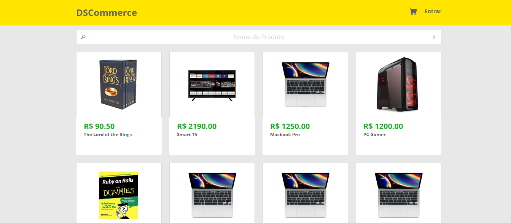

## DSCommerce - ReactJS-based App on @devsuperior - ReactJS Professional 
Going down to key concepts of ReactJS such as 
- Components
- Routes
- State Management
- JSX
- TypeScript
- Yarn
- Vite
- Axios
## _Table of contents_
- [Overview](#overview)
- [Screenshot](#screenshot)
- [Links](#links)
- [Built with](#built-with)
- [What I practiced](#what-i-practiced)
- [Continued development](#continued-development)
- [Resources](#useful-resources)
- [Author](#author)
- [Acknowledgments](#acknowledgments)
## _Overview_
The design is structured as shown:
- src|
    - App.tsx
    - assets|
    - components|
        - ButtonPrimary
          - index.tsx
          - styles.css
        - ButtonSecondary
          - ...
        - CatalogCard
          - ...
        - HeaderClient
          - ...
        - ProductCategory
          - ...
        - ProductDetailsCard
          - ...
        - SearchBar
          - ...
   - routes
        - Catalog
        - ProductDetails
   - App.tsx
   - index.css
   - main.tsx
   - index.html
   - tsconfig.json
   - tsconfig.node.json
   - vite.config.js
   - yarn.lock
- public|

## _Screenshot_
[]()
## _Links_
- Live Site URL: [] 
## _Built with_

  |  |  |  |  |  |  | | 

 ## _What I practiced_
```jsx
import './styles.css';
import ButtonBlue from "../../../components/ButtonPrimary";
import ButtonWhite from "../../../components/ButtonSecondary";
import ProductDetailsCard from "../../../components/ProductDetailsCard";
import { Link } from 'react-router-dom';
import { useEffect, useState } from 'react';
import { ProductDTO } from '../../../models/product';
import axios from 'axios';

export default function ProductDetails() {

  const [ product, setProduct] = useState<ProductDTO>();
  useEffect(() => {
    
    axios.get("http://10.0.0.195:8080/products/1")
    .then(response => {
      console.log(response.data);
      setProduct(response.data);
    })
    .catch(function (error) {
      if (error.response) {
        console.log(error.response.data);
        console.log(error.response.status);
        console.log(error.response.headers);
      } else {
        console.log('Error', error.message);
      }
    })

  }, []);

  return (
    <>
      <main>
        <section id="product-details-section" className="dsc-container">
          {
            product &&
            <ProductDetailsCard product={product} />
          }
          <div className="dsc-btn-page-container">
            <ButtonBlue text="Comprar" />
            <Link to={'/'}>
              <ButtonWhite text="Inicio" />
            </Link>
          </div>
        </section>
      </main>
    </>
  );
}

``` 

## _Continued development_
- Next step: Keep moving forward 
### _Useful resources_
- [https://reactjs.org] React lets you build user interfaces out of individual pieces called components!.
- [https://yarnpkg.org/] Open-source package manager used to manage dependencies in  JavaScript.
- [https://vitejs.dev/guide/] Build tool that aims to provide a faster and leaner development experience for modern web projects.
## _Author_
- Website - [https://ferreiras.dev.br] 
## Acknowledgments
- @devsuperior
